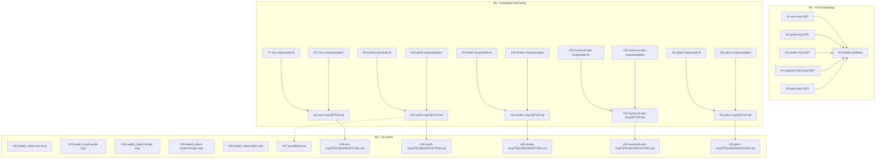

# Setup UX Improvement Plan

> **STATUS: COMPLETE** — All 32 issues (M1 + M2 + M3) resolved and merged as of 2026-03-23.

Goal: make every MCP server easy to set up and use for non-technical people with their favourite LLM chat client.

**Target platform: Ubuntu / Debian / Linux Mint (apt-based distros only).**
macOS and Windows are out of scope for now.

**Each server is installed and used independently.** A user who only wants audio synthesis should not need to know the other servers exist.

---

## Approach: publish to PyPI, run via `uvx`

Instead of asking users to clone a git repository and run install scripts, each server is published as a package on PyPI. The user's LLM client config then references the package by name:

```json
{
  "mcpServers": {
    "synth": {
      "command": "uvx",
      "args": ["synth-mcp"],
      "env": { "SYNTH_SOUNDFONT_PATH": "/home/alice/.local/share/sounds/sf2/TimGM6mb.sf2" }
    }
  }
}
```

`uvx` (part of `uv`) downloads, caches, and runs the package in one step — no git clone, no `uv sync`, no path management. This is the standard distribution pattern for MCP servers in the wider ecosystem.

The only remaining manual steps are:
1. Install `uv` (one-liner)
2. Install system libraries (`apt`)
3. For synth-mcp: obtain a soundfont file

These are handled by a small per-server `install.sh` that has nothing to do with the source code.

---

## Current State

> All blockers resolved. Deliverables shipped across 32 issues in three milestones.

~~All five servers work and have developer docs, but a non-technical person faces these blockers:~~

| Blocker | Severity | Resolution |
|---------|----------|------------|
| ~~No PyPI packages — users must clone the repo and manage paths manually~~ | High | ✅ All five servers published to PyPI; `uvx` handles install |
| ~~Must install `uv` manually — not a standard tool~~ | High | ✅ `install.sh` per server installs `uv` |
| ~~System libs (`libfluidsynth`, `libcairo`, `libportaudio2`) require `apt` commands~~ | High | ✅ `install.sh` per server installs required packages |
| ~~Must download a soundfont and know the path (synth-mcp)~~ | High | ✅ `install.sh` auto-downloads TimGM6mb.sf2; `soundfonts.md` documents alternatives |
| ~~No single "start here" document per server written for non-technical users~~ | High | ✅ `SETUP.md` added to each server |
| ~~No guidance on which LLM clients work and how to configure them~~ | High | ✅ `examples/` per server with Claude Desktop, Cursor, Windsurf, Continue, Zed configs |
| ~~omr-mcp silently downloads 100 MB of models on first use — looks like a hang~~ | Medium | ✅ Progress message added via `health_check` tool and first-run output |
| ~~No troubleshooting guide when things go wrong~~ | Medium | ✅ `TROUBLESHOOTING.md` added to each server |

---

## Proposed Improvements

### 1. Publish each server to PyPI

Each server already has a valid `pyproject.toml` with an entry point (`omr-mcp`, `synth-mcp`, etc.). Publishing to PyPI is straightforward:

- Add a `[tool.hatch.build]` section (or equivalent) to include `src/` correctly
- Choose package names: `omr-mcp`, `synth-mcp`, `render-mcp`, `musicxml-abc-mcp`, `pitch-mcp`
- Set up a GitHub Actions workflow (`publish.yml`) that publishes to PyPI on a version tag
- Version each package independently (they are independent servers)

Once published, the installation step for the user is simply handled by `uvx` at first run — no explicit install command needed at all.

**Effort:** Small per server (pyproject.toml is already correct). Medium for the CI/CD publish workflow.

---

### 2. Per-server system dependency installer — `<server>/install.sh`

The only thing `uvx` cannot handle is OS-level libraries. Each server gets a minimal `install.sh` that:

1. Checks the distro is apt-based; exits with a clear message otherwise
2. Installs `uv` if missing (`curl -LsSf https://astral.sh/uv/install.sh | sh`)
3. Installs only the system libraries **this server** needs

System library matrix:

| Server | apt packages |
|--------|-------------|
| omr-mcp | *(none — oemer is pure Python + ONNX)* |
| synth-mcp | `libfluidsynth-dev` |
| render-mcp | `libcairo2` |
| musicxml-abc-mcp | *(none)* |
| pitch-mcp | `libportaudio2` (optional, real-time mode only) |

For synth-mcp, `install.sh` also downloads TimGM6mb.sf2 to `~/.local/share/sounds/sf2/` if no soundfont is found.

Scripts for omr-mcp and musicxml-abc-mcp only need to install `uv` — they can be a single file.

**Effort:** Small. Simpler than before because there is no `uv sync` or path management.

---

### 3. Per-server setup and usage guide — `<server>/SETUP.md`

Each server gets a `SETUP.md` written for non-technical users. With PyPI distribution the steps are much shorter:

```
<server>/SETUP.md
├── What this server does (2–3 sentences, plain English)
├── Requirements
│   ├── OS: Ubuntu / Debian / Linux Mint
│   └── System libraries (server-specific, if any)
├── Installation
│   └── Run ./install.sh  ← installs uv + system libs only
├── Connect to your LLM client
│   ├── Claude Desktop  ← paste config snippet, uvx handles the rest
│   ├── Cursor
│   ├── Windsurf / VS Code + Continue
│   └── Other (generic MCP stdio)
├── What you can ask your AI assistant (example prompts)
└── Something went wrong → link to TROUBLESHOOTING.md
```

Server-specific notes:

| Server | Notable SETUP.md content |
|--------|--------------------------|
| omr-mcp | Warn: first run downloads ~100 MB of models, takes ~5 min |
| synth-mcp | Soundfont: what it is, how install.sh gets one, how to use a better one |
| render-mcp | No special requirements beyond `libcairo2` |
| musicxml-abc-mcp | No system libraries at all — simplest install |
| pitch-mcp | Two modes: offline analysis (no extra deps) vs. real-time mic (needs `libportaudio2`) |

**Effort:** Small — shorter than before because there is no clone/sync/path step to explain.

---

### 4. Per-server LLM client config snippets — `<server>/examples/`

Replace the current `examples/claude_desktop_config.json` (which hard-codes a local path) with
`uvx`-based snippets that work for any user without path editing:

```
<server>/examples/
├── claude_desktop_config.json
├── cursor_mcp.json
├── windsurf_mcp.json
├── continue_config.json
└── zed_settings.json
```

Linux config file locations per client:

| Client | Config location |
|--------|----------------|
| Claude Desktop | `~/.config/claude/claude_desktop_config.json` |
| Cursor | `~/.cursor/mcp.json` (global) or `.cursor/mcp.json` (workspace) |
| Windsurf | `~/.codeium/windsurf/mcp_config.json` |
| VS Code + Continue | `~/.continue/config.json` |
| Zed | `~/.config/zed/settings.json` |

Because `uvx` needs no local path, most snippets are copy-paste ready with no edits.
Only synth-mcp requires the user to fill in their soundfont path.

**Effort:** Small.

---

### 5. First-run experience improvements (small code changes per server)

- **omr-mcp:** Print a progress message when models download on first use:
  `"Downloading OMR models (~100 MB). This only happens once and takes ~5 minutes."`
  Currently the server is silent, which looks like a hang.

- **synth-mcp:** If `SYNTH_SOUNDFONT_PATH` is unset at startup, print actionable instructions:
  which file to download, where to put it, how to add the env var to the client config.

- **All servers:** Add a `health_check` tool (or extend `list_capabilities`) that returns a
  human-readable summary: soundfont found ✓, libcairo installed ✓, models cached ✓, etc.

**Effort:** Small per server.

---

### 6. Soundfont guide — `synth-mcp/docs/soundfonts.md`

- What a soundfont is (one sentence)
- Recommended free options: TimGM6mb (~6 MB, auto-downloaded by install.sh), GeneralUser GS (~30 MB), MuseScore General (~200 MB)
- Recommended install path: `~/.local/share/sounds/sf2/`
- How to point synth-mcp to it (env var in LLM client config)

Linked from `synth-mcp/SETUP.md`.

**Effort:** Tiny.

---

### 7. Per-server troubleshooting guide — `<server>/TROUBLESHOOTING.md`

Common entries (all servers):

| Symptom | Cause | Fix |
|---------|-------|-----|
| `uvx: command not found` | uv not installed | Re-run `install.sh` |
| Server not appearing in LLM client | Config JSON syntax error | Validate JSON |
| Client says "server disconnected" | Server crashed at startup | Check terminal output |

Server-specific entries:

| Server | Symptom | Fix |
|--------|---------|-----|
| synth-mcp | No audio produced | `SYNTH_SOUNDFONT_PATH` not set in client config |
| omr-mcp | Appears to hang on first use | Downloading 100 MB models — wait ~5 min |
| render-mcp | `libcairo` not found | `sudo apt install libcairo2` |
| pitch-mcp | Real-time mic fails | `sudo apt install libportaudio2` |

**Effort:** Small.

---

## Priority Order

| Priority | Item | Status |
|----------|------|--------|
| 1 | Publish all five servers to PyPI | ✅ Done (issues #1–#5) |
| 2 | GitHub Actions publish workflow | ✅ Done (issue #6) |
| 3 | `<server>/install.sh` (all five) | ✅ Done (issues #7–#11) |
| 4 | `<server>/SETUP.md` (all five) | ✅ Done (issues #12–#16) |
| 5 | `<server>/examples/` client configs (all five) | ✅ Done (issues #17–#21) |
| 6 | First-run messages + `health_check` tool | ✅ Done (issues #22–#26) |
| 7 | `synth-mcp/docs/soundfonts.md` + `<server>/TROUBLESHOOTING.md` | ✅ Done (issues #27–#32) |

---

## Issue Dependency Graph

GitHub has no native dependency graph. The diagram below is rendered by GitHub in this markdown file and also embedded as "Depends on #X" references in the relevant issue bodies.



**Solid arrows** = hard dependency (must be merged before starting).
**Dashed arrow** = soft dependency (soundfonts.md can be written independently but must be linked from synth-mcp/SETUP.md).

**What can run in parallel:**
- All of M1 (#1–#6): fully independent of each other
- install.sh (#7–#11): fully independent
- examples/ (#17–#21): fully independent
- health_check (#22–#26): fully independent
- TROUBLESHOOTING.md (#28–#32) and soundfonts.md (#27): independent of each other

**Bottlenecks:**
- SETUP.md per server (#12–#16) is each blocked by two issues (install.sh + examples/)
- The publish workflow (#6) is blocked by all five PyPI prep issues

---

## GitHub Execution Strategy

The repository already has a Claude Code GitHub App workflow (`.github/workflows/claude.yml`) that triggers automatically when an issue body contains `@claude`. The plan is executed entirely through GitHub Issues — no separate task tracker needed.

---

### Labels

Create these labels in the repository before opening issues:

| Label | Purpose |
|-------|---------|
| `server:omr-mcp` | Scopes issue to omr-mcp |
| `server:synth-mcp` | Scopes issue to synth-mcp |
| `server:render-mcp` | Scopes issue to render-mcp |
| `server:musicxml-abc-mcp` | Scopes issue to musicxml-abc-mcp |
| `server:pitch-mcp` | Scopes issue to pitch-mcp |
| `server:all` | Applies to all servers or the root project |
| `type:pypi` | PyPI publishing work |
| `type:ci` | GitHub Actions / CI work |
| `type:installer` | install.sh work |
| `type:docs` | SETUP.md / TROUBLESHOOTING.md / guides |
| `type:code` | Code changes inside a server |
| `type:config` | Client config snippets in examples/ |

---

### Milestones

Three milestones matching the priority order:

| Milestone | Issues |
|-----------|--------|
| **M1 — PyPI publishing** | PyPI packaging + publish workflow |
| **M2 — Installation & setup** | install.sh + SETUP.md + client configs |
| **M3 — UX polish** | First-run messages + health_check + soundfonts + troubleshooting |

---

### Issue breakdown

One issue per server per deliverable. Each issue body contains enough context for Claude to act on it with a single `@claude` trigger — either automatically on open, or on demand via a comment.

**M1 — PyPI publishing (6 issues)**

- `Prepare omr-mcp for PyPI publishing` · `server:omr-mcp` `type:pypi`
- `Prepare synth-mcp for PyPI publishing` · `server:synth-mcp` `type:pypi`
- `Prepare render-mcp for PyPI publishing` · `server:render-mcp` `type:pypi`
- `Prepare musicxml-abc-mcp for PyPI publishing` · `server:musicxml-abc-mcp` `type:pypi`
- `Prepare pitch-mcp for PyPI publishing` · `server:pitch-mcp` `type:pypi`
- `Add GitHub Actions publish workflow` · `server:all` `type:ci`

**M2 — Installation & setup (15 issues, 3 per server)**

For each server:
- `Create <server>/install.sh` · `type:installer`
- `Create <server>/SETUP.md` · `type:docs`
- `Create <server>/examples/ client config snippets` · `type:config`

**M3 — UX polish (11 issues)**

- `Add first-run messages and health_check tool to <server>` × 5 · `type:code`
- `Create synth-mcp/docs/soundfonts.md` · `server:synth-mcp` `type:docs`
- `Create <server>/TROUBLESHOOTING.md` × 5 · `type:docs`

**Total: 32 issues**

---

### How to write issues so Claude acts correctly

The workflow triggers when an issue body contains `@claude`. Each issue should follow this template:

```
Brief description of what is needed and why.

Read `docs/SETUP_UX_PLAN.md` for full context.

Relevant files to read first:
- <list files Claude needs to understand before acting>

Acceptance criteria:
- [ ] specific, testable outcome
- [ ] specific, testable outcome

@claude <imperative instruction — what to create or change>
```

The `@claude` line at the end is both the trigger and the instruction. Keep it specific:
- Good: `@claude create synth-mcp/install.sh as described in this issue`
- Bad: `@claude help`

Issues for M1 and M2 are self-contained enough to run in parallel once opened.
M3 issues should only be opened after the relevant server's M1 + M2 issues are merged.

---

### Workflow

1. Create labels and milestones in GitHub
2. Open all M1 issues → Claude starts on each automatically → review PRs → merge
3. Open all M2 issues (can open in parallel per server, but SETUP.md should follow install.sh) → review PRs → merge
4. Open M3 issues → review PRs → merge
5. Track progress on a GitHub Project board (Kanban: Backlog → In Progress → In Review → Done)

---

## Out of Scope (for now)

- **macOS and Windows:** Excluded from this phase.
- **Non-apt Linux distros (Fedora, Arch, etc.):** `install.sh` exits early with a clear message.
- **Docker:** Better suited for Phase 2 when the web PoC needs it.
- **Debian `.deb` / Snap / Flatpak packages:** PyPI + uvx covers the use case with far less maintenance overhead.
