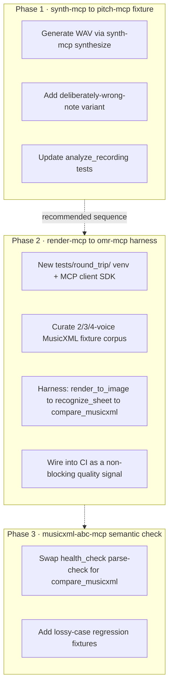

# Round-Trip Testing Across MCP Servers

Analysis date: 2026-08-16

## Goal

Identify pairs of MCP tools where one converts input A → output B and another converts
B (or an equivalent) back toward A, so the pair can be chained into a closed-loop test:
feed a known-good input through the pair (and usually `comparer-mcp` as the verifier) and
check that the output matches the original. This gives synthetic, unlimited ground-truth
test fixtures without depending on external scanned scores or human recordings.

**Caveat, read before trusting the score:** a round trip only proves self-consistency,
not real-world correctness — see [Validity & Guardrails](#validity--guardrails) below
for why a rising round-trip score doesn't automatically mean the solution is improving
in the right direction, and what keeps it honest.

---

## Priority

| Priority | Pair | Why | Effort |
|----------|------|-----|--------|
| **1** | render-mcp ↔ omr-mcp (via comparer-mcp) | Targets an actual open, critical, root-caused bug (SATB voice loss) — omr-mcp is the only server not marked complete. No regression test exists for it today beyond eyeballing two CPDL fixtures. This loop turns "root-caused" into "measured," with a quantitative similarity score per voice count, and becomes the harness that verifies any future fix. | Medium–large |
| **2** | synth-mcp → pitch-mcp | pitch-mcp is already complete (112 unit + 4 integration passing), so this hardens a working thing rather than catching a known defect. But it directly replaces a documented weak point — `tests/fixtures/soprano_phrase.wav` is a sine-tone proxy, not real audio — with realistic soundfont-rendered output, at low cost. | Small |
| **3** | musicxml-abc-mcp self round-trip | Lowest priority: already complete, 74/74 passing, and already has a round-trip `health_check`. Upgrading it from parse-only to a semantic diff closes a blind spot, but there's no known bug behind it. | Small |

Recommended order: do #2 first as a quick win (cheap, self-contained), then invest in #1
(the harness with real payoff), then #3 as polish once the pattern is proven.

---

## Tool inventory (inputs → outputs)

| Server | Tool | Input | Output |
|--------|------|-------|--------|
| omr-mcp | `recognize_sheet` / `recognize_sheets` | image (single/multi-page) | MusicXML |
| render-mcp | `render_to_image` | MusicXML | PNG/SVG |
| render-mcp | `render_to_pdf` | MusicXML | PDF (multi-page) |
| synth-mcp | `synthesize` | MusicXML + voice/tempo | WAV |
| musicxml-abc-mcp | `musicxml_to_abc` | MusicXML | ABC |
| musicxml-abc-mcp | `abc_to_musicxml` | ABC | MusicXML |
| pitch-mcp | `analyze_recording` | WAV + reference MusicXML | per-note pitch accuracy + position |
| comparer-mcp | `compare_musicxml` / `quick_similarity` | MusicXML × MusicXML | structured diff / similarity score |

---

## 1. render-mcp ↔ omr-mcp, closed via comparer-mcp

- [`render_to_image`](../render-mcp/src/render_mcp/server.py) (render-mcp/src/render_mcp/server.py:58): MusicXML → PNG/SVG
- [`recognize_sheet`](../omr-mcp/src/omr_mcp/server.py) (omr-mcp/src/omr_mcp/server.py:22): image → MusicXML
- [`compare_musicxml`](../comparer-mcp/src/comparer_mcp/server.py) (comparer-mcp/src/comparer_mcp/server.py:40): diffs recovered vs. original MusicXML

**Loop:** known-good MusicXML → `render_to_image` → `recognize_sheet` → `compare_musicxml(original, recovered)`.

**Value:** generates unlimited synthetic OMR test fixtures with a known-correct answer,
instead of relying only on scanned CPDL/PDMX images (which currently top out at a small,
hand-picked fixture set — see omr-mcp's HANDOVER.md). Directly useful against the
already-root-caused SATB voice-loss bug (`oemer`'s 2-track assumption in
`align_symbols()`): this loop can quantify how much the comparer's similarity score
degrades as voice count increases (2 → 3 → 4 parts), instead of a binary pass/fail on a
handful of real scores.

**Reverse direction is weaker:** scanned image → `recognize_sheet` → `render_to_image` →
visual diff vs. the original scan has no image-diff tool in this project to close the
loop, so it isn't actionable without adding one.

---

## 2. musicxml-abc-mcp's own two directions, closed via comparer-mcp

- [`musicxml_to_abc`](../musicxml-abc-mcp/src/musicxml_abc_mcp/server.py) (musicxml-abc-mcp/src/musicxml_abc_mcp/server.py:22) and
  [`abc_to_musicxml`](../musicxml-abc-mcp/src/musicxml_abc_mcp/server.py) (musicxml-abc-mcp/src/musicxml_abc_mcp/server.py:47) are already an inverse pair within one server.
- Its own `health_check` tool already performs "a short MusicXML → ABC → MusicXML
  round-trip," but only checks that the result *parses* — not that it's *semantically
  equivalent* to the input.

**Improvement:** route the round-trip through `compare_musicxml` / `quick_similarity`
instead of a parse-only smoke test. ABC notation drops or approximates things MusicXML
carries (articulations, some voicing/layout detail); a parse-success check can't catch
that kind of semantic drift, but a structured diff would.

---

## 3. synth-mcp → pitch-mcp, replaces a known synthetic-fixture gap

- [`synthesize`](../synth-mcp/src/synth_mcp/server.py) (synth-mcp/src/synth_mcp/server.py:37): MusicXML → WAV, via real fluidsynth soundfont rendering
- [`analyze_recording`](../pitch-mcp/src/pitch_mcp/server.py) (pitch-mcp/src/pitch_mcp/server.py:31): WAV + reference score → per-note pitch accuracy

**Loop:** synthesize a known MusicXML score → feed that WAV + the same score into
`analyze_recording` → since the audio is synthetic ground truth, accuracy should be
~100% and note positions should track exactly; any deviation is a bug in pitch-mcp's
pYIN/DTW pipeline, not singer error.

**Value:** pitch-mcp's own test fixture
(`pitch-mcp/tests/fixtures/soprano_phrase.wav`) is currently a synthesized sine-tone
proxy, not a real recording or real synth-mcp output — a known open item in its
HANDOVER.md. Swapping in actual `synthesize` output (real soundfont timbre/harmonics)
would be a strictly more realistic regression fixture, since sine tones lack the
harmonic complexity pYIN has to handle for real voices. This can also be extended into
mutation testing: synthesize a score, then synthesize a deliberately-wrong-note
variant, and confirm `analyze_recording` correctly flags the inaccuracy rather than
scoring it as correct.

---

## Not a viable pair

- **comparer-mcp** has no inverse of its own — it's the oracle all three loops above
  rely on to close the loop, not a round-trip partner itself.
- **omr-mcp → musicxml-abc-mcp** (recognize a sheet, then convert to ABC for
  human/LLM review) is a useful QA chain but not a round trip: nothing converts ABC
  back into an image to close the loop.
- **pitch-mcp** cannot feed back into any reverse tool: its output (position/accuracy)
  is not MusicXML or audio, so synth-mcp → pitch-mcp is a one-directional validity
  check, not a true inverse pair.

---

## Phased Implementation Plan

Each server keeps its own venv (hard rule — see root `CLAUDE.md`), so no phase below
merges dependencies across servers at runtime. Phase 1 and 3 generate fixtures/compare
offline or via each server's own `engine.py` (already required to be importable without
the MCP stack); only Phase 2 needs a genuine multi-server harness, and that harness gets
its **own** dedicated venv rather than reusing render-mcp's or omr-mcp's.

### Phase 1 — synth-mcp → pitch-mcp fixture (quick win)

**Goal:** replace the sine-tone proxy fixture with real synthesized audio.

1. Generate a WAV via synth-mcp's `synthesize` from `pitch-mcp`'s existing
   `reference.musicxml`, commit it to `pitch-mcp/tests/fixtures/` alongside (or in
   place of) `soprano_phrase.wav`. One-time offline generation — no runtime
   cross-server dependency, so no venv changes needed.
2. Generate a second fixture from a deliberately-mistuned/wrong-note variant of the
   same score, for a mutation-style regression case.
3. Update `analyze_recording` tests to assert: ~100% accuracy and correct note
   positions on the clean fixture; correctly-flagged inaccuracy on the mutated one.

**Acceptance criteria:** pitch-mcp's suite passes against the new fixture; the mutated
fixture is reliably flagged as inaccurate (not a false pass).

**Real-world gap this phase does NOT close:** both the old sine-tone fixture and the
new synth-mcp fixture are still synthetic — neither has real vocal timbre, vibrato, or
room noise. See [Real-World Validation Data](#real-world-validation-data) below for
the recorded-audio gap this phase leaves open.

**Effort:** ~0.5–1 day.

### Phase 2 — render-mcp ↔ omr-mcp regression harness (main investment)

**Goal:** turn the root-caused SATB bug into a quantified, repeatable regression
signal.

1. New top-level `tests/round_trip/` directory with its **own** venv, depending only
   on an MCP client SDK — drives render-mcp and omr-mcp as real subprocesses over
   stdio, exactly as a production client would. Avoids merging oemer's ML stack with
   render-mcp's cairo/Verovio stack.
2. Curate a fixture corpus of MusicXML scores at 2-, 3-, and 4-voice SATB — reuse
   existing CPDL/PDMX-derived scores where possible, hand-author minimal
   music21-generated scores for controlled voice-count scaling where not.
3. Harness loop per fixture: MusicXML → `render_to_image` → `recognize_sheet` →
   `compare_musicxml(original, recovered)` → record similarity score.
4. **Calibrate against real-world data, not just the synthetic loop:** also run
   `recognize_sheet` directly on the real scanned/engraved images already sitting in
   `omr-mcp/test_samples/{cpdl,pdmx}_satb_samples/` (see
   [Real-World Validation Data](#real-world-validation-data)) against their paired
   ground-truth `.mxl`, via the same `compare_musicxml` scoring. Track the synthetic
   score and the real score side by side per voice count — if the synthetic score
   improves but the real score doesn't, the synthetic loop has stopped being a valid
   proxy (see [Validity & Guardrails](#validity--guardrails)).
5. Emit a report (checked-in table or CI job summary) of similarity score by voice
   count — synthetic and real side by side — so degradation is visible at a glance
   and fix progress is trackable over time.
6. Wire into CI as a **non-blocking** quality signal initially (the known bug means
   it will score low, not fail cleanly); convert to a blocking gate once a fix lands
   or an agreed similarity threshold is set.

**Acceptance criteria:** harness runs end-to-end across all three voice-count
buckets and produces a similarity score per bucket; the SATB degradation is visible
in the numbers (e.g. 2-voice high, 4-voice much lower).

**Effort:** ~3–5 days (new test infra + fixture curation + CI wiring).

### Phase 3 — musicxml-abc-mcp semantic round-trip (polish)

**Goal:** upgrade the existing parse-only round-trip check to a semantic diff.

1. Extend musicxml-abc-mcp's test suite (and/or its `health_check` tool) to run
   `compare_musicxml` / `quick_similarity` after the MusicXML → ABC → MusicXML
   round trip, instead of only checking that the result parses. Since both servers
   operate on plain MusicXML strings with no heavy binary deps, this can call
   comparer-mcp's `engine.py` directly as a dev dependency rather than needing a
   subprocess harness.
2. Add regression fixtures for known ABC-lossy cases (complex articulations,
   cross-staff voicing) where parse-only would pass but content has drifted.

**Acceptance criteria:** round-trip check reports a similarity score, not just a
boolean; at least one fixture demonstrates semantic drift that a parse-only check
would have missed.

**Effort:** ~1 day.

---

## Validity & Guardrails

A round trip only proves **self-consistency** — that A→B→A returns close to A. It does
not by itself prove **real-world correctness**, and a rising similarity score can be
misleading in two specific ways:

1. **Correlated/symmetric bugs cancel out.** If a bug in tool A is systematically
   undone by tool B (e.g., both consistently mishandle the same rare notation the same
   way), the round trip scores perfect while both tools are still wrong on that input.
   Risk is lowest for render-mcp ↔ omr-mcp (independent codebases — Verovio vs.
   oemer), highest for musicxml-abc-mcp's self round-trip (same server, same author,
   same blind spots on both conversion directions — nothing independent grades it).
2. **Synthetic input is cleaner than real input.** render-mcp's PNGs have no scan
   skew, lighting, paper texture, or JPEG artifacts; synth-mcp's audio has no room
   noise, vibrato, or real vocal timbre. A tool can ace the synthetic loop and still
   fail on the messy real input it has to handle in production — a high score is
   necessary, not sufficient.

What keeps the score pointed in the correct direction:

- **Corroborate with independent root-causing, not score-watching alone.** The
  omr-mcp SATB bug is already diagnosed at the code level
  (`oemer/build_system.py::MeasureContainer.align_symbols()`'s hard 2-track assert),
  so Phase 2's harness isn't the sole oracle — it corroborates a cause already
  understood by other means. A rising score after a fix should be checked against
  *that* cause, not just accepted as "score went up."
- **comparer-mcp is a separate codebase** from what it grades in two of the three
  loops (render/omr, synth/pitch) — it wasn't derived from their internals, so it's
  unlikely to share their specific errors. It's the weakest link in the abc-mcp loop,
  where nothing independent grades the thing under test.
- **Keep a small real-world fixture set alongside the synthetic one**, and check
  periodically that they move together. If the synthetic round-trip score improves
  but the real CPDL-scan / real-recording fixtures don't, the synthetic loop has
  stopped being a valid proxy and needs recalibrating — e.g. injecting scan noise/skew
  into render-mcp's output, or adding room noise/reverb to synth-mcp's audio, to close
  the realism gap.
- **Track the score as a trend per fixture across commits, not a one-shot gate.** A
  single point-in-time pass/fail can't show direction; a logged series can distinguish
  "genuinely improving" from "noisy" or "regressing."

---

## Real-World Validation Data

What actually exists today, and what's still missing, per server:

| Server | Real-world data available today | Gap |
|--------|----------------------------------|-----|
| omr-mcp | ✅ Yes — see below | None; already the calibration set for Phase 2 |
| pitch-mcp | ❌ No — only synthetic fixtures + a `manual`-marked live-mic test skipped in CI | Needs real recorded singing (see below) |
| synth-mcp | N/A — deterministic renderer, not a recognition/scoring model; no ground-truth ambiguity to validate against | — |
| musicxml-abc-mcp | ❌ No — round-trips only its own generated ABC | Optional; see below |
| comparer-mcp | ✅ Indirectly — its own tests already diff against omr-mcp's real PDMX `.mxl` ground truth (`comparer-mcp/tests/test_engine.py::_SATB_MXL_DIR`) | None |

### omr-mcp — already has real data (reuse it, don't recreate it)

`omr-mcp/test_samples/` (gitignored, fetched on demand — not committed as binary
assets) holds two real-world corpora, each with paired ground-truth MusicXML:

- **`cpdl_satb_samples/`** — 5 named public-domain SATB choral works scanned from
  real engravings, sourced from CPDL via `download_cpdl_satb.py`:
  *Ave verum corpus* (Byrd), *If ye love me* (Tallis), *Locus iste* (Bruckner),
  *O magnum mysterium* (Victoria), *Sicut cervus* (Palestrina). Each piece directory
  has page-PNGs plus a ground-truth `.mxl`.
- **`pdmx_satb_samples/`** — 10 pieces / 42 PNG pages pulled from the 250K+-score
  PDMX dataset (Zenodo) via `download_pdmx_satb.py`, filtered to SATB a cappella;
  `pdmx_full/PDMX.csv` is the full index if the sample needs to be widened later.

These are exactly the real-world leg Phase 2's calibration step needs — no new data
collection required, just point the harness's real-world pass at these directories
(see Phase 2 step 4 above) instead of only the synthetic render→recognize loop.
Because the corpus is gitignored, CI must run the two `download_*_satb.py` scripts
(or a cached copy) before the harness executes.

### pitch-mcp — the real gap

There is no committed real recording anywhere in the repo — `soprano_phrase.wav` is a
synthesized proxy, and `TestRealMicrophoneLifecycle` in `test_manual.py` requires live
microphone hardware and is skipped in every automated run. Phase 1's synth-mcp fixture
improves realism but is still synthetic, so it cannot validate pYIN against real vocal
signal (breath noise, vibrato, imperfect pitch, room acoustics).

**Proposed follow-up (not yet scheduled as a phase):** record a small set (5–10 clips)
of real singers performing `reference.musicxml` (or an equivalently short phrase) a
cappella, on a phone or laptop mic — no studio needed, choir member volunteers are
enough. Commit them to a new `pitch-mcp/tests/fixtures/real_world/` directory
alongside the score they were sung against, and add a `@pytest.mark.integration` (not
`manual`) test class that runs `analyze_recording` against each and asserts accuracy
stays within a documented tolerance band, not ~100% — real singers aren't perfectly in
tune, so the acceptance bar here is "plausible accuracy for a competent singer," which
needs a human (e.g., the choir director) to sanity-check the expected range once, not
per-run. This is the one piece of real-world data in this plan that requires a human
data-collection step rather than a script — cannot be automated the way CPDL/PDMX
downloads are.

### musicxml-abc-mcp — optional, lowest priority

Public ABC corpora exist externally (e.g. thesession.org, abcnotation.com tune
archives) and could serve as a real-world stand-in for hand-written ABC, as opposed to
round-tripping only ABC the server itself generated. Given Phase 3 is already the
lowest-priority phase and has no known bug behind it, this is worth revisiting only if
Phase 3's semantic round-trip starts surfacing real drift worth investigating against
externally authored ABC — not worth the licensing/curation effort up front.
